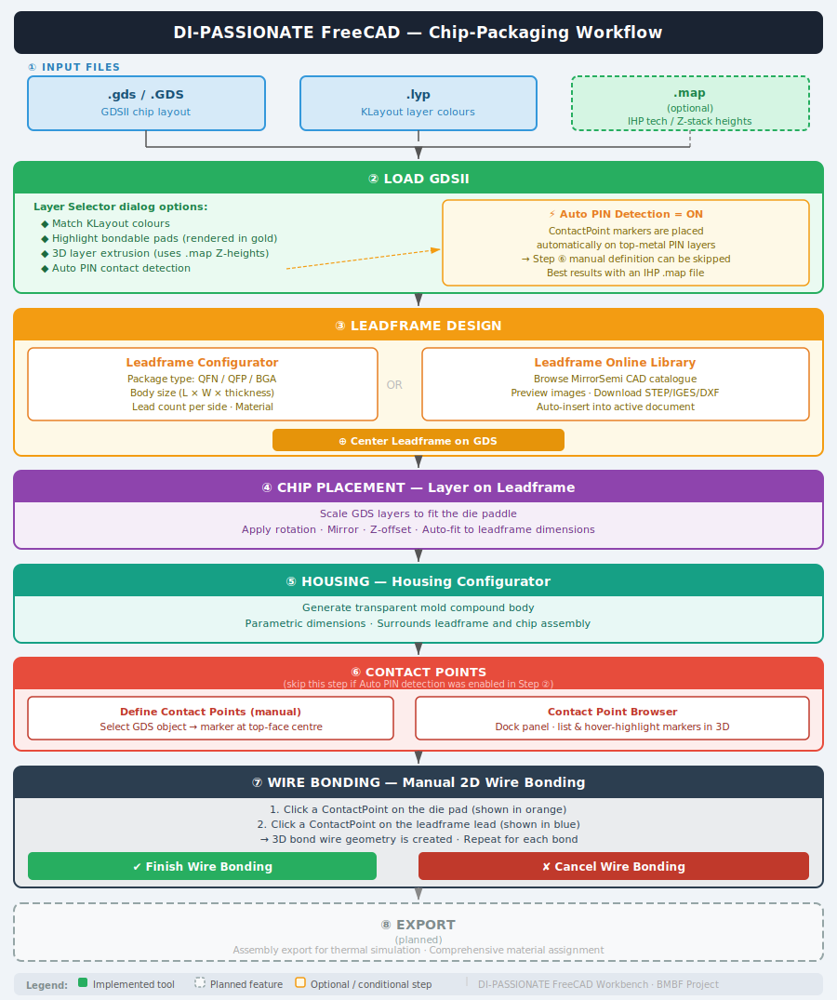

# DI-PASSIONATE-FreeCAD

**Development of a FreeCAD plugin for the BMBF project DI-Passionate to enable chip-packaging**

This is a Python AddIn for the open-source software [FreeCAD](https://www.freecad.org/downloads.php). It provides a dedicated workbench for chip-packaging workflows: importing GDSII chip layouts, designing leadframes and housings, placing chips, planning bond wires, and preparing assemblies for simulation.

---

## Features

### Implemented

| Tool | Description |
|---|---|
| **Load GDSII** | Import GDS files with layer colours from a KLayout `.lyp` file and optional IHP `.map` technology file |
| **Leadframe Configurator** | Parametrically generate QFN, QFP, or BGA leadframes with configurable body size, lead count, and material |
| **Center Leadframe on GDS** | Auto-align the leadframe centre to the bounding box of the imported GDS geometry |
| **Leadframe Online Library** | Browse, preview, and download STEP/IGES/DXF packages from the MirrorSemi CAD catalogue |
| **Layer on Leadframe** | Scale and place selected GDS layers on an existing leadframe with rotation and mirror options |
| **Housing Configurator** | Generate a transparent IC housing body around the leadframe |
| **Define Contact Points** | Place bondable contact-point markers on selected GDS layer objects |
| **Contact Point Browser** | Dock panel to list and highlight all contact points in the 3D view |
| **Manual Wire Bonding** | Interactive session: click a die-pad contact point, then a leadframe contact point — a 3D bond wire is created |
| **Cancel Wire Bonding** | Exit an active wire-bonding session without saving |
| **Help Guide** | In-app help dialog with Overview, Quick Start, Tools, Workflows, and Troubleshooting tabs |

### Planned / In Progress

- Export of assemblies for thermal simulations
- Expanded material assignment system
- Online library integration beyond MirrorSemi

---

## Workflow Overview



---

## Typical Workflow

| Step | Tool | Details |
|------|------|---------|
| **1** | **Load GDSII** | Select `.gds` + `.lyp` (+ optional `.map`), choose layers, optionally enable Auto PIN Detection |
| ↓ | | |
| **2** | **Leadframe Configurator** or **Online Library** | Generate QFN / QFP / BGA leadframe, then run **Center Leadframe on GDS** |
| ↓ | | |
| **3** | **Layer on Leadframe** | Scale and rotate the GDS chip onto the die paddle |
| ↓ | | |
| **4** | **Housing Configurator** | Generate transparent mold compound body |
| ↓ | | |
| **5** | **Define Contact Points** | Manual contact point placement — skip if Auto PIN Detection was used in step 1 |
| ↓ | | |
| **6** | **Manual Wire Bonding** | Click die pad → click leadframe lead → 3D bond wire created; repeat per bond |
| ↓ | | |
| **7** | **Export** *(planned)* | Assembly export for thermal simulation |

---

## GDS Import Options

When loading a GDSII file the **Layer Selector** dialog exposes several import options:

| Option | Effect |
|---|---|
| **Match KLayout colours** | Apply exact fill/frame colours from the `.lyp` file |
| **Highlight bondable pads** | Render top-metal / PIN layers in gold |
| **3D extrusion** | Extrude each layer to its real Z-height using the `.map` stack definition |
| **Auto PIN contact detection** | Automatically create `ContactPoint` markers on the top PIN layers |

Filler layers (marked `FILL` in the `.map` file) are represented as a single bounding-box solid to keep import performance high.

A progress dialog with a **Cancel** button is shown during import.

---

## File Inputs

| File | Purpose |
|---|---|
| `.gds` / `.GDS` | GDSII layout (output of KLayout, Cadence, etc.) |
| `.lyp` | KLayout layer properties — defines layer colours and visibility |
| `.map` | IHP technology map — layer names, EDI types, Z-stack heights |

The IHP Open PDK (including sample `.map` files) can be downloaded from:
<https://github.com/IHP-GmbH/IHP-Open-PDK>

---

## Setup

### 1. Install the AddIn

Clone the repository into the FreeCAD `Mod` directory:

```bash
# Windows
git clone <repository-url> "C:/Users/%USERPROFILE%/AppData/Roaming/FreeCAD/Mod/DI-PASSIONATE-FreeCAD"

# Linux
git clone <repository-url> ~/.local/share/FreeCAD/Mod/DI-PASSIONATE-FreeCAD
```

Restart FreeCAD. The **GDSII Workbench** will appear in the workbench selector.

### 2. Python dependencies

The AddIn uses `gdstk` for reading GDS files. Install it into FreeCAD's Python environment:

```bash
# Windows (adjust path to match your FreeCAD version)
"C:/Program Files/FreeCAD 1.0/bin/python.exe" -m pip install gdstk

# Linux
freecad-python3 -m pip install gdstk
```

---

## Developer Setup (VSCode)

1. Clone the repository into the FreeCAD `Mod` folder (see above).
2. Open the project folder in VSCode.
3. Create `.vscode/settings.json` with the extra Python paths so IntelliSense resolves FreeCAD modules:

**Windows**

```json
{
    "python.analysis.extraPaths": [
        "C:/Program Files/FreeCAD 1.0/bin",
        "C:/Users/%USERNAME%/AppData/Roaming/Python/Python311/site-packages",
        "C:/Program Files/FreeCAD 1.0/bin/Lib/site-packages"
    ]
}
```

**Ubuntu / Linux**

```json
{
    "python.analysis.extraPaths": [
        "/home/%USER%/usr/lib",
        "/home/%USER%/usr/lib/python3.11/site-packages"
    ]
}
```

> Replace `%USERNAME%` / `%USER%` with your actual home-directory name.

### Remote debugging with debugpy

Set the environment variable `FREECAD_DEBUGPY=1` before launching FreeCAD. The workbench will listen on `localhost:5678` and wait for VS Code to attach before continuing.

```bash
# Windows PowerShell
$env:FREECAD_DEBUGPY = "1"; & "C:\Program Files\FreeCAD 1.0\bin\FreeCAD.exe"

# Linux / macOS
FREECAD_DEBUGPY=1 freecad
```

Add a **Python: Remote Attach** launch configuration in `.vscode/launch.json`:

```json
{
    "name": "Attach to FreeCAD",
    "type": "python",
    "request": "attach",
    "connect": { "host": "localhost", "port": 5678 }
}
```

---

## Project Structure

```
DI-PASSIONATE-FreeCAD/
├── InitGui.py                  # Workbench registration & toolbar definition
├── Get_Path.py                 # Path helpers (icons, HTML resources)
├── core/
│   ├── Core_Functionality.py   # GDS parsing, shape building, layer styling
│   ├── leadframe.py            # Leadframe solid geometry builder
│   ├── housing.py              # Housing solid geometry builder
│   └── Color.py                # Colour utilities
├── gds/
│   ├── GDSCommand.py           # "Load GDSII" command + import pipeline
│   └── PropertyPanel.py        # Layer properties dock panel
├── leadframe/
│   ├── LeadframeCommand.py     # Leadframe Configurator + Center Leadframe commands
│   ├── LeadframeConfigurator.py# QFN / QFP / BGA configuration dialog
│   ├── LeadframeLibrary.py     # Online library browser (MirrorSemi)
│   └── LayeronLeadframe.py     # Layer-on-Leadframe command & dialog
├── housing/
│   ├── HousingCommand.py       # Housing Configurator command
│   └── HousingConfigurator.py  # Housing configuration dialog
├── wirebond/
│   ├── WirebondCommand.py      # Wire bonding commands (manual, cancel, browser)
│   ├── WirebondConfigurator.py # Wire bonding session configuration dialog
│   ├── ManualWireBonding.py    # Interactive bonding session logic
│   ├── ContactPointTool.py     # "Define Contact Points" command
│   ├── ContactPointPanel.py    # Contact Point Browser dock panel
│   └── Wirebon_Confi_Support.py# Prerequisite checks
├── ui/
│   ├── LayerSelector.py        # Layer selection dialog (used during GDS import)
│   ├── ExtendedPropertyPanel.py
│   └── LayeronLeadframeConfigurator.py
└── help/
    └── HelpGuideCommand.py     # In-app help guide (HTML tabs)
```

---

## Mindmap / Design Notes

<https://lucid.app/lucidspark/ebb96ac9-c6d3-408a-9ead-51c1aa83efa1/edit?invitationId=inv_3ef9b6cf-fcc6-4717-8b34-9a1598ceaaf7>

A possible target UI showing a configuration module for chip-packaging elements:


---

## Contributing / Feedback

Issues and pull requests are welcome. Please open an issue describing any bug or feature request before submitting a large PR.
