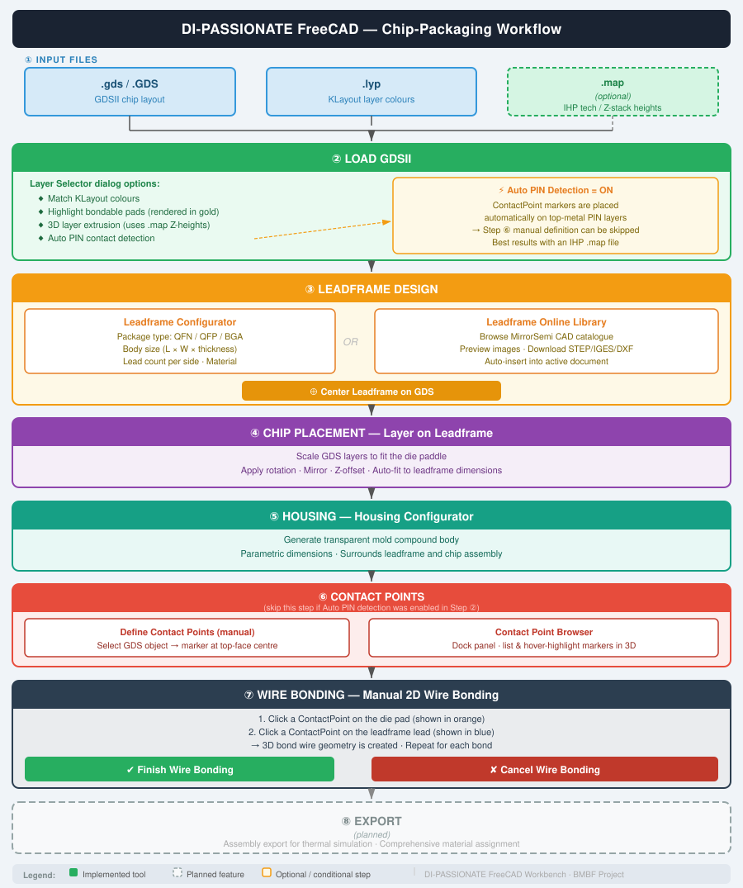

# Chip-Packaging Workbench for FreeCAD


**An open-source FreeCAD workbench for chip-packaging design, developed as part of the BMBF research project DI-PASSIONATE.**

It covers the full chip-assembly flow in one environment: importing GDSII layouts and PCBs,
placing dice, generating leadframes and housings, routing conductor traces, planning wire
bonds and bumps, and saving the result as a native FreeCAD document.

> **Project status:** actively developed and not yet API-stable. Interfaces and file
> layouts may change between minor versions.

---

## Contents

- [Requirements](#requirements)
- [Installation](#installation)
- [Feature Reference](#feature-reference)
- [Typical Workflow](#typical-workflow)
- [GDSII Import](#gdsii-import)
- [Trace Routing](#trace-routing)
- [Symmetric Placement](#symmetric-placement)
- [PCB Integration](#pcb-integration)
- [Wire Bonding](#wire-bonding)
- [Contact Point System](#contact-point-system)
- [Ports](#ports)
- [KiCad boards and nets](#kicad-boards-and-nets)
- [Multi-die and stacked assemblies](#multi-die-and-stacked-assemblies)
- [Materials and Thermal Export](#materials-and-thermal-export)
- [Supported File Formats](#supported-file-formats)
- [Session Save and Load](#session-save-and-load)
- [Development](#development)
- [Roadmap](#roadmap)
- [Contributing](#contributing)
- [License](#license)

---

## Requirements

| Component | Version | Notes |
|---|---|---|
| FreeCAD | 1.1 or newer | Ships its own Python 3.11 — no separate install required |
| `gdstk` | any recent | Required for GDSII parsing; install into FreeCAD's Python |
| Draft workbench | bundled | Required by the Interactive Router (ships with FreeCAD) |
| Internet access | — | Only for the online leadframe library |

## Installation

Full instructions, including developer tooling and remote debugging, are in
**[INSTALL.md](INSTALL.md)**. Short version:

```powershell
# 1. Clone into FreeCAD's user Mod folder
git clone <repository-url> "$env:APPDATA\FreeCAD\Mod\DI-PASSIONATE-FreeCAD"

# 2. Install the GDSII dependency into FreeCAD's own Python
& "C:\Program Files\FreeCAD 1.1\bin\python.exe" -m pip install gdstk
```

Restart FreeCAD and choose **Chip-Packaging Workbench** in the workbench selector.

> **"Another folder on the Python path provides the same module names"** in the Report view
> means a second copy of this workbench — or another addon using a name such as `core` or
> `ui` — is installed. Python imports each name from whichever folder comes first, so which
> code runs depends on folder order. Remove or rename the other folder; the message names it.

---

## Feature Reference

Tools are grouped into toolbars matching the design flow. Each toolbar carries a short
caption (Tech, Import, Render, Package, Bonding, Routing, Workbench).

### Technology

| Tool | Description |
|---|---|
| **Technology Configuration** | Select the active PDK profile (`.lyp` / `.map` / stackup `.xml`) once and reuse it across all import dialogs. The status bar shows which files resolved. Two PDKs ship with the workbench — see [Bundled PDKs](#bundled-pdks). |

### Import

| Tool | Description |
|---|---|
| **PCB Import** | Load a PCB from STEP; copper pad faces are auto-detected as ContactPoints. |
| **Move / Rotate PCB** | Reposition a loaded PCB together with all of its pad ContactPoints. |
| **Import KiCad** | Import components with their 3-D models, pads and nets from a KiCad board — see [KiCad boards and nets](#kicad-boards-and-nets). |
| **Load GDSII** | Import `.gds` with KLayout colours, optional technology map and stackup for true Z-heights. Supports level-of-detail import. |
| **View in GDS3D** | Open the selected chip's full layout in the external GDS3D viewer, generating its process file from the active PDK. Requires GDS3D installed separately. |
| **Texture Chip Proxy** | Paint a proxy with a picture of its own layout so several proxies stay tellable apart — optional, purely visual. |
| **Import Chip Proxy** | Create a lightweight stand-in for a die — footprint, real stack thickness and bond-pad positions only. Loads in well under a second on full-chip layouts that take minutes to tessellate in full. |

### Rendering

| Tool | Description |
|---|---|
| **Toggle VIA Detail** | Replace dense via arrays with clustered blocks to keep the viewport responsive. |
| **Detail Layer Control** | Dock panel showing every layer's load state; promote routing layers to full geometry on demand. |
| **Layer Slider** | Step through the layer stack from bottom to top for a quick review. |

### Package Assembly

| Tool | Description |
|---|---|
| **Move / Rotate Chip** | Translate and rotate chip geometry as a group. Scopes: GDS objects, a single chip proxy (optionally with package and PCB), the current selection, or the whole document. |
| **Leadframe Library** | Browse and import STEP package models from the MirrorSemi online catalogue. |
| **Set Contact Points on Face** | Grid-based placement: pick faces, generate a UV grid, select points, confirm. |
| **Interactive Contact Point** | Place individual contact points by clicking directly in the 3-D view. |
| **Detect Package Pads** | Find the bond-finger plane of an imported package model and place a contact point on every finger — see [Bond fingers on a package model](#bond-fingers-on-a-package-model). |
| **Stack Die** | Put one die on another with the die attach between them, and report overhang and buried pads — see [Multi-die and stacked assemblies](#multi-die-and-stacked-assemblies). |
| **Dies** | Dock panel listing every die with its tier, size, pads and how many are bonded; isolates one tier at a time. |
| **Contact Point Symmetry** | Mirror, symmetrize or generate contact points about the centre of one or many faces — see [Symmetric Placement](#symmetric-placement). |
| **Contact Point Pattern** | Place points face by face with a live cross-hair preview and exact numeric entry, optionally copying an existing point's position — see [Copying a point onto other faces](#copying-a-point-onto-other-faces). |
| **Confirm / Undo / Abort** | Contextual toolbar shown only while a pattern session is active. |
| **Contact Point Browser** | Dock panel listing all contact points by group, with hover highlighting. |

### Trace Routing

| Tool | Description |
|---|---|
| **Interactive Route** | KiCad-style live router — see [Trace Routing](#trace-routing). |
| **Trace Routing** | Grid and search based point-to-point router with angle presets. |
| **Batch Auto-Route** | Queue several pad pairs, then route and bake them all in one pass. |
| **Drag Trace** | Re-shape an existing trace by dragging it; it walks around other copper live. |
| **3-D Route** | Route a trace across the faces of a 3-D body, connecting pads on different faces — see [Routing across a 3-D body](#routing-across-a-3-d-body). |
| **Confirm / Abort / End** | Contextual toolbar shown only while a routing session is active. |

### Design Rule Check

| Tool | Description |
|---|---|
| **Design Rule Check** | Checks routed traces and bond wires for clearance, trace width, wire-to-wire spacing, crossings in plan view, wire length, bond angle, clearance over the die edge and headroom under the lid — see [Checking bond wires](#checking-bond-wires). Click a finding to select the offending objects. |

### Ports

| Tool | Description |
|---|---|
| **Define Port** | Draw simulation ports on the layout's own edges, one after another — see [Ports](#ports). |

### Netlist

| Tool | Description |
|---|---|
| **Nets** | Dock panel listing every net with its pads, how many connections are still open and how many are routed. |
| **Update Ratsnest** | Redraw the rubber lines. They are also redrawn automatically after every trace is routed. |

### Thermal Simulation

| Tool | Description |
|---|---|
| **Assign Materials** | Tag every solid with its material — from the stackup, the leadframe and housing settings, or the kind of part — and list the ones it cannot decide. See [Materials and Thermal Export](#materials-and-thermal-export). |
| **Export for Thermal Simulation** | Write the assembly as one STEP file per material, a Gmsh script with one physical volume per material, a material-property table and a manifest. |

### Wire Bonding

| Tool | Description |
|---|---|
| **Wire Bond** | Interactive bonding session: click a die pad, then a package or PCB pad; a solid bond wire is created. |
| **Wire Bump Configurator** | Place parametric bumps (ball, wedge, stitch, nail head) at wire endpoints via a netlist browser. |
| **Propose Netlist** | Write a first pinout for a die and package that have none: each pad bonded to the pin facing it — see [Proposing a pinout](#proposing-a-pinout). |
| **Import Netlist** | Bond every connection in a CSV netlist, matching pads by name, layout label, pin number or lead — see [Netlist import](#netlist-import). |
| **Export Bonding Diagram** | Write a plan-view bonding diagram (SVG) and a wire table (CSV) — see [Bonding diagram](#bonding-diagram). |
| **Confirm / Abort** | Contextual toolbar shown only while a bonding session is active. |

### Advanced Tools (dropdown)

| Tool | Description |
|---|---|
| **Leadframe Configurator** | Generate parametric QFN, QFP or BGA leadframes. |
| **Center Leadframe** | Align the leadframe to the imported die geometry. |
| **Housing Configurator** | Generate a mould-compound body around the leadframe. Its cavity floor is the plane the leadframe stands on (z = 0, or the underside of the balls for a BGA), so the two never share volume. |
| **Add Lid** | Add or resize a lid on an existing housing. |
| **Layer on Leadframe** | Scale, rotate and place GDS layers onto a leadframe. |
| **Define Contact Points** | Batch-place markers at the top-face centre of selected layer objects. |
| **Pin Numbering** | Generate pin-number labels around a leadframe. |
| **Clear GDSII Import Cache** | Delete cached import results (imports are cached automatically; ~10x faster re-open). |
| **Create Desktop Shortcut** | Windows only — put an icon on the desktop that opens FreeCAD straight into this workbench. |

### Workbench

**Session ▾** (save / load a design as a native `.FCStd`), **Advanced Tools ▾**,
**Chip Theme ▾**, **Help Guide** (in-app documentation), and **About**.

---

## Appearance

### Chip Theme

The workbench ships an optional dark skin — a silicon-slate base with a
material-coloured accent — applied while the workbench is active. The 3-D viewport
background is matched to it, so the viewport does not read as a bright hole in a dark window.

**It is off by default.** It was briefly on unless switched off, which meant a workbench
repainted the whole of FreeCAD before being asked to; worse, an absent preference resolved to
the default flavour rather than to "off", so any loss of the setting — a reset config, a new
profile — silently brought the skin back. A one-shot migration switches it off for anyone
carrying a flavour from then and restores their viewport colours.

Pick an accent from the **Chip Theme ▾** dropdown:

| Flavour | Accent | Evokes |
|---|---|---|
| **Copper** (default) | `#c87137` | A routed trace |
| **Gold** | `#d4a017` | A bond wire |
| **Solder** | `#3f8f5a` | Solder mask |
| **Silicon** | `#5a7fa8` | A bare die, for anyone who finds warm accents loud |

Only the accent changes; the dark base is shared, so switching flavour does
not mean re-learning the interface.

The skin is **scoped to this workbench and fully reversible**:

- It is layered on the main window, never on `QApplication`, so your own
  FreeCAD theme is not overwritten — Qt propagates the sheet to child
  widgets, which is what makes one line of setup reach every panel.
- Switching to another workbench removes it, restoring FreeCAD's normal look.
  Installing this workbench therefore never changes how the rest of FreeCAD
  appears.
- The 3-D background lives in FreeCAD's parameter store rather than in Qt, so
  it cannot be undone by dropping a stylesheet. The previous values are
  stashed before they are replaced and restored when the theme is switched
  off — your own colours come back, not a guess at the defaults.

Choose **Off** in the dropdown to go back to FreeCAD's native colours; the choice is
remembered between sessions. Switching off restores the viewport colours that were stashed
before the skin was applied — and if no stash survives (the preference file was reset), the
keys are **deleted** so FreeCAD's own defaults return. Writing a guessed "default" instead
would be wrong in exactly the situation that matters.

### Desktop Shortcut (Windows)

**Advanced Tools ▾ → Create Desktop Shortcut** puts a launcher on the desktop
that starts FreeCAD and opens directly in this workbench. It asks before
creating or replacing anything.

FreeCAD has no `--workbench` command-line switch, so the shortcut instead
passes FreeCAD a small generated macro
(`resources/DI-PASSIONATE_Launch.FCMacro`), which FreeCAD executes once the
GUI is up. That macro *retries* rather than activating once: FreeCAD
discovers `Mod/` directories on a timer, so a single immediate call would
succeed or fail depending on disk speed. If the workbench never registers,
the macro says so in the Report view and FreeCAD simply opens normally.

The icon is written as a genuine multi-size `.ico`
(16/24/32/48/64/128/256 px) rather than one bitmap, because Windows picks a
different size for the taskbar, the desktop and the alt-tab switcher, and a
single-size icon gets the rest by smearing that one.

If your Desktop is redirected to OneDrive — the norm on managed Windows 11 —
the shortcut is written there rather than to `%USERPROFILE%\Desktop`, which
by then is usually an empty folder nobody looks at.

---

## Typical Workflow



| Step | Tool | Purpose |
|---|---|---|
| 1 | Technology Configuration | Select the PDK profile once |
| 2 | Load GDSII *or* Import Chip Proxy | Bring in the die — full geometry, or a fast stand-in for layout work |
| 3 | Leadframe Library *or* Leadframe Configurator | Import or generate the package |
| 4 | Center Leadframe | Align package to die |
| 5 | Move / Rotate Chip, or Stack Die for a second tier | Fine-tune die placement |
| 6 | Housing Configurator *(optional)* | Add mould compound and lid |
| 7 | Detect Package Pads *or* Set Contact Points on Face | Define bonding locations |
| 8 | Propose Netlist → Import Netlist, *or* Wire Bond by hand | Create bond wires |
| 8a | Wire Bump Configurator *(optional)* | Add end bumps |
| 9 | Interactive Route *(optional)* | Route conductor traces on the board or package |
| 10 | Design Rule Check | Check clearances, wire spacing and headroom under the lid |
| 11 | Assign Materials → Export for Thermal Simulation *(optional)* | Hand the assembly to a thermal solver |
| 12 | Session ▾ → Save | Store the assembly as `.FCStd` |

---

## GDSII Import

Large layouts are kept fast by two measures, both tuneable. A **polygon budget**
(`AUTO_POLY_BUDGET`, 25,000) caps how many polygons are built as real geometry across all
layers, collapsing the heaviest remaining layers to bounding boxes until the import fits —
this bounds the *time*, which a per-layer threshold alone cannot. Bounding-box extents are
computed in one batched pass rather than per polygon, which on a 3.2-million-polygon layout
is a 14x saving on that phase by itself. Measured end to end on a real 46 MB, 3.2M-polygon
chip: **135 s before, 18 s after**; a 15 MB chip went from 70 s to 11 s. Promoting a layer
to full detail (Detail Layer Control) bypasses the budget, so nothing you ask for
explicitly is collapsed behind your back.

Imports are **cached to disk automatically**. Measured on a real 15 MB, 70-layer chip, a
full B-rep import builds 92,000 solids / 630,000 faces in about 70 s; re-opening the same
layout from cache takes roughly 10 s. The cache key folds in the file's modification time
and every import option, so it can never serve stale geometry. It is capped at 2 GB with
least-recently-used eviction — a single full-chip entry is around 100 MB — and
*Advanced Tools -> Clear GDSII Import Cache* empties it.

The layer selector exposes the import options that matter for large layouts:

| Option | Effect |
|---|---|
| Match KLayout colours | Apply exact fill and frame colours from the `.lyp` |
| Highlight bondable pads | Render top-metal and PIN layers in gold |
| 3-D extrusion | Extrude each layer to its real Z-height from the stackup |
| Contacts-only 3-D | Full geometry for bond-pad layers only; everything else collapses to a bounding solid |
| Auto PIN contact detection | Create ContactPoint markers on top PIN layers automatically |

### Exactly as KLayout draws it

**Exactly as KLayout draws it** in the import dialog builds every polygon as drawn, with the
`.lyp`'s own colours. Off by default — see the cost below.

The workbench has seven independent mechanisms that trade geometry for speed. Each is worth
having, and **each on its own is enough to make the document disagree with KLayout**, so the
option switches off all of them together rather than exposing seven checkboxes:

| | Mechanism | What it does |
|---|---|---|
| 1 | Per-layer polygon threshold | layer → bounding box above 5,000 polygons |
| 2 | Total polygon budget | heaviest layers → bounding box |
| 3 | Micro-area pre-scan | layer → bounding box below 2 µm² median |
| 4 | Dummy-fill collapsing | FILL layers → bounding box |
| 5 | Area filter / decimation | drops or simplifies small outlines |
| 6 | Level-of-detail loading | non-contact layers deferred, shown as one body box |
| 7 | Via blocks | via arrays → clustered blocks |

Colours also come straight from the `.lyp` with **no bondable repaint** — the gold highlight
on pad layers is useful for wire bonding but is the one thing that makes an otherwise
faithful view disagree with KLayout on colour.

Explicit per-layer **BBox** ticks in the layer list are still honoured: the option switches
off the *automatic* rules, not your own choices.

Verified against KLayout's own polygon counts on `IC_Pad_EdgeSeal.boundary.gds` — 1,056
polygons across six layers, matching layer for layer:

| Layer | Default | Exact | KLayout |
|---|---|---|---|
| TopVia1 (125/0) | 1 | **884** | 884 |
| TopVia2 (133/0) | 1 | **154** | 154 |
| Metal5, TopMetal1/2, EdgeSeal | ✓ | ✓ | ✓ |

**The cost is the reason those mechanisms exist.** Every polygon becomes an OCCT solid, and a
full chip carries millions — `6_final.gds` alone has 3.2 M. The dialog shows the polygon
count for the file you are importing and an estimated build time before you commit, so the
decision is made with the real number rather than a generic warning.

### Boundary layers are drawn flat

`.boundary` layers — `EdgeSeal.boundary`, `prBoundary.boundary`, `Metal1.boundary` — are
**annotation, not material**. They mark an extent; they do not describe a film that exists
at a height. They are now built as a **zero-thickness face at z = 0**, flat on the die
surface directly above the epi, which is also how KLayout draws them.

Previously they were extruded. None of them appears in the stackup XML, so each got a
rank-based *fallback* Z and became a 0.2 µm slab floating at an arbitrary height — how
arbitrary: the same `EdgeSeal.boundary` came out at 0.0–0.2 µm with one set of layers loaded
and at **9.0–9.2 µm** with another, because the fallback simply ranks whatever it is given.

Detected by the `.boundary` name suffix, so the drawing layers are untouched — `TopMetal2`
keeps its 3 µm thickness at 11.2303 µm, and only the annotation went flat.

### A layer showing as a plain rectangle

If a layer looks like a featureless die-sized box, check its label: an unloaded layer is now
labelled **`[not loaded]`** and ghosted to 80 % transparency.

In level-of-detail mode only contact layers load at import; every other layer gets a
*placeholder* box carrying that layer's own name and colour. That is indistinguishable in the
tree from the layer loaded and collapsed to a bounding box, which made "why is this layer
just a rectangle?" a recurring question. The label now says which it is, and the marker is
stripped the moment real geometry replaces it.

To get the real shape: tick the layer in the import dialog (**Select All** loads everything),
promote it in **Detail Layer Control**, or use **Exactly as KLayout draws it**, which loads
every layer in full.

### Units

Dimensions already match KLayout exactly and always did; no option is involved. Checked
against KLayout's own status-bar reading for the seal ring of `GSGPad_simple` —
`box(0,-150000 120000,150000)` at 1 nm per database unit:

| | X | Y |
|---|---|---|
| KLayout | 0 → 120.000 µm | −150.000 → 150.000 µm |
| FreeCAD | 0.000 → 120.000 µm | −150.000 → 150.000 µm |

The only difference is the display unit: FreeCAD's document unit is the millimetre, so the
same edge reads `0.12 mm` where KLayout shows `120 µm`. FreeCAD has no micrometre unit
schema to switch to, so the numbers on screen differ by a factor of 1000 while the geometry
is identical to the nanometre. Z heights come from the stackup XML and are converted from µm
the same way.

### The die body (epi + substrate)

**Add the die body below the layout** in the import dialog (on by default) builds the
silicon a die is actually made of.

A die is mostly *not* the interconnect. On IHP SG13G2 the drawn stack is 14.23 µm and the
body beneath it is 183.75 µm — 3.75 µm of epi on 180 µm of substrate — so modelling only the
layers produced an object with **under 8 % of the real part's thickness**. Anything treating
the die as a physical thing was working from the wrong solid: bond-wire clearance, package
cavity height, a thermal export.

The stackup XML already declared both, as `<Dielectric>` entries — `parse_stackup_xml` simply
discarded that section. The body is now derived from them:

| PDK | Body | Total |
|---|---|---|
| IHP SG13G2 | Substrate 180 µm, then EPI 3.75 µm | 183.75 µm |
| SkyWater SKY130 | Substrate 298 µm, then EPI 2 µm | 300 µm |

The slabs span the **die outline** (seal ring / prBoundary), not the bounding box of whatever
layers happened to load — in LOD mode that is two contact layers, which would put a substrate
under only part of the die. Each is tagged `IsDieBody` and records its `StackMaterial`, is
coloured from the stackup's own `<Material>` entry, and is 60 % transparent (silicon is the
largest object in the document and would otherwise hide the entire layout).

Which dielectrics form the body is **derived, not assumed**: the `<Dielectrics>` list runs
top-down and also contains AIR, passivation and inter-metal oxide, none of which belong below
the die — AIR alone is 200 µm and would more than double it. Accumulating from the bottom
until the total reaches the declared `<Substrate Offset>` picks out exactly the right
entries, and the sum then acts as a check. If the two disagree, **nothing is built** and a
warning says why: a body of the wrong depth would look plausible and be silently wrong.

The result meets the die's own `z0` underneath and lands exactly on z = 0 on top, so the
proxy and the full import describe the same physical part.

**The body moves with the chip.** Move / Rotate Chip's "GDS Chip Objects" scope matches the
slabs by their `IsDieBody` property rather than by name — `_GDS_PREFIXES` lists only the
narrower `GDS_Pin_` / `GDS_PINs_`, so a prefix scan matched neither `GDS_Substrate` nor
`GDS_EPI` and moving a chip left its own silicon behind. Property matching also survives the
objects being relabelled, the same reasoning already used for chip proxies.

This also corrects **place chip on surface**: the chip's bottom is now the underside of the
silicon (−183.75 µm on SG13G2) rather than the lowest drawn layer, so what lands on a carrier
is the face that physically touches it.

### Filling the gap under a partial import

A PDK defines more levels than any one layout draws on. If the lowest layer a design uses is
Metal5, nothing sits between the silicon and **5.09 µm** — but that volume is not empty in
the real part: it is the oxide the unused metal levels are embedded in.

**Fill the gap below the lowest used layer with dielectric** (on by default) builds a slab of
the stackup's own inter-metal dielectric from the die surface up to the lowest used layer, so
every layer keeps its true PDK height and the die is a solid column.

Which dielectric is **derived, not named**: `<Dielectrics>` runs top-down and ends with the
entries that make up the die body, so the one immediately above the body is the inter-metal
oxide — SiO2 on both bundled PDKs. Everything above *that* is passivation and air, which sit
over the top metal, not under the lowest one.

Measured on `IC_Pad_EdgeSeal.boundary.gds`, the die is now contiguous from its underside to
the lowest drawn layer:

| Slab | Z range | Thickness |
|---|---|---|
| Substrate | −183.7500 → −3.7500 µm | 180 µm |
| EPI | −3.7500 → 0.0000 µm | 3.75 µm |
| **SiO2 fill** | **0.0000 → 5.0900 µm** | **5.09 µm** |
| Metal5 (lowest used layer) | 5.0900 → 5.5800 µm | 0.49 µm |

No seams and no overlaps between them. On a full import there is nothing to fill — Activ
already sits at z = 0 — and the slab is not built at all.

### Closing the gap by moving the stack instead

**Drop the layer stack onto the die surface** in the import dialog — now **off** by default,
since filling the gap is the physically correct answer and this one is not.

Importing a subset of the layers leaves the loaded stack floating. Selecting only the top of
an SG13G2 stack puts Metal5 at 5.09 µm with nothing beneath it, because Activ, the contacts
and Metal1–4 were never built — a **4.89 µm gap** between the die surface and the lowest
thing in the document. The seal-ring outline sits down at the surface while the metals hover
above it.

The loaded layers now slide down together so the lowest one starts at z = 0, on top of the
epi. Relative spacing is preserved — the stack moves as one — and the substrate and epi do
not move.

Two rules keep the correction from doing damage:

- **Only layers whose height the stackup actually states are measured and moved.** Marker
  layers — `EdgeSeal.boundary`, `prBoundary`, `Recog` — are absent from the stackup and get
  rank-based fallback heights that carry no physical meaning. (This is why the seal ring sat
  at 0.0–0.2 µm in one file and at 1.6–1.8 µm, interleaved among real metals, in another.)
  They stay put, which is where the die outline belongs.
- **It is a no-op for a full import.** When Activ is loaded it already sits at z = 0, the
  shift computes to zero, and every layer keeps its true PDK height. Verified on
  `6_final.gds`: shift 0.0000 µm.

Measured on `IC_Pad_EdgeSeal.boundary.gds`, a top-of-stack selection:

| Layer | Before | After |
|---|---|---|
| EdgeSeal.boundary (marker) | 0.0000 µm | 0.0000 µm — not moved |
| Metal5 (lowest real layer) | 5.0900 µm | **0.0000 µm** |
| TopMetal2 | 11.2303 µm | 6.1403 µm |

It slides the loaded layers down together so the lowest one starts at z = 0. That closes the
same gap, but by **falsifying every Z height in the model** — Metal5 ends up at 0 instead of
its real 5.09 µm. Kept because it gives a compact view when the true heights do not matter,
but prefer the dielectric fill above.

### VIA layers

**Keep VIA layers in full detail** in the import dialog (on by default) guarantees that via
arrays are built as real geometry.

**Four** separate mechanisms in the loader can replace a via layer with a box, and all four
produce the same falsehood: separate pillars between two metals become a solid slab shorting
them together, with no error reported anywhere.

| Mechanism | Trips on | Result |
|---|---|---|
| Per-layer polygon threshold | > 5,000 polygons | layer → its own bbox |
| Total polygon budget | heaviest layers first | layer → its own bbox |
| Micro-area pre-scan | median polygon < 2 µm² | layer → its own bbox |
| **`contacts_only_3d` body box** | any non-contact layer in LOD mode | layer merged into **one die-wide slab** |
| **Automatic via simplification** | *every* import, unconditionally | real via arrays hidden, replaced by clustered blocks |

The last one runs *after* the geometry is built and swaps the finished via arrays for
clustered blocks, so on its own it undid every protection applied during the build — which is
how an import could log `VIA detail protected` and still show blocks. It is now skipped when
**Keep VIA layers in full detail** is on.

### Turning the blocks on when you want them

**Toggle VIA Detail** (Render toolbar) switches between the two at any time. The blocks are
**built on demand** the first time you switch to them, so skipping them at import costs
nothing later — there is no need to re-import to get them back.

**What a block is:** one axis-aligned cube per proximity *cluster* of vias, spanning that
cluster's X/Y outline and the vias' full Z range — so it still bridges the same two metals.
Not one box per layer, which would fuse physically separate arrays together. Measured on
`IC_Pad_EdgeSeal.boundary.gds`:

| Layer | Real vias | As blocks | X/Y outline | Z range |
|---|---|---|---|---|
| TopVia1 (125/0) | 884 solids | **2 cubes** | 13.860 × 221.420 µm — unchanged | 5.5800–6.4303 µm — unchanged |
| TopVia2 (133/0) | 154 solids | **2 cubes** | 12.660 × 220.500 µm — unchanged | 8.4303–11.2303 µm — unchanged |

Three things had to be fixed for the switch to be dependable:

- **The state is read from the document, not from a module global.** The global records what
  was last *applied*, which is a different thing — an import can finish in either state, a
  document can be reopened, a block can be deleted by hand. When the two disagreed the first
  press computed the wrong direction, re-applied what was already showing, and appeared to do
  nothing; the blocks only arrived on a second press. `document_shows_via_blocks()` now asks
  the document, so the first press always does something visible.
- **Which layers count as vias.** The toggle tested for the substring `"via"`, which misses
  SG13G2's `Vmim` and *all* of SKY130's vertical connections — they are called `mcon` and
  `licon1`. Those layers could never be simplified at all. It now shares the same token list
  the import uses, so the layers protected at import are exactly the layers the toggle can
  block.
- **The import checkbox states both outcomes.** It read "Keep VIA layers in full detail
  (never auto-simplify)", so the only way to ask for blocks at import was to reason backwards
  and untick it. It now reads "*untick to show them as blocks*".

The last is the one that survives the others and is the most visibly wrong: it does not
collapse the layer to its own bounding box, it merges it into the single combined body
solid, so the via array becomes a block spanning the whole die that visibly bridges pads
sharing nothing. It fires on layers you *explicitly ticked* for immediate load, because LOD
mode categorises vias as "routing" and only contact layers escape the accumulator.

The micro-area scan catches every chip regardless of size. It was written to kill sub-micron
dummy fill and trips below 2 µm² — but **a via is sub-micron by definition**. SG13G2's
TopVia1 measures 0.1764 µm². All four mechanisms now consult the protected set, and the
bbox ones report the layer they kept in the Report view.

Measured on `samples/IC_Pad_EdgeSeal.boundary.gds` (the GSGPad cell), imported in LOD mode
exactly as the GUI does it:

| Layer | Before | After |
|---|---|---|
| TopVia1 (125/0) | 1 solid, 0.1000 × 0.2800 × 0.0792 mm — the die-wide body slab | **884 solids**, 0.0139 × 0.2214 × 0.0009 mm |
| TopVia2 (133/0) | 1 solid, same slab | **154 solids**, 0.0127 × 0.2205 × 0.0028 mm |

A via layer is identified from three independent sources, since no PDK provides all three:
the stackup's `Type="via"`, the stream map's `VIA` type, and the layer name. The map test
needs care — IHP's `sg13g2.map` lists `VIA` among the types for *every* routing metal
(`Metal1 NET,SPNET,PIN,LEFPIN,VIA`), because a metal can carry via shapes in the EDI stream;
what separates a real via is the absence of `NET`/`SPNET`.

Full via detail is not free: on a 3.2-million-polygon chip, a six-layer import goes from
**10 s to 63 s** and builds 101,187 via solids instead of two boxes. Turn the option off, or
mark a specific layer as a bounding box in the layer list — an explicit per-layer request
still outranks the blanket protection.

Two other, deliberate ways to reduce via detail remain untouched, and both keep the array's
structure rather than replacing it with a slab: **Toggle VIA Detail** (proximity clustering
into blocks — this is what creates the `GDS Via Blocks` group) and per-layer bounding boxes
in the layer selector.

> **If an import still shows flattened vias, clear the import cache**
> (Advanced Tools ▾ → Clear GDSII Import Cache). Entries written before this
> release were built with the vias already collapsed. The cache key now covers
> every argument that changes the geometry, so old entries can no longer be
> matched — but a `GDS cache hit … skipping import` line in the Report view
> immediately after `VIA detail protected` is the signature of a stale entry.

### Level of Detail

With LOD active, layers are categorised before anything is loaded:

| Category | Import behaviour |
|---|---|
| Contact layers (PIN, COMP, top/bottom metal) | Full 3-D geometry, loaded immediately |
| Pure PIN-marker layers | Flat 2-D polygons, loaded immediately |
| Fill / dummy metal | Bounding solid only, never tessellated |
| Routing layers | Transparent placeholder at the correct Z — loaded on demand |

Routing layers are promoted to full geometry from the **Detail Layer Control** panel,
either individually, by dragging a Z-cursor through the stack, or all at once in
background threads. Initial import stays in the seconds range for chips that would
otherwise take minutes.

---

## Trace Routing

Four routers are provided; all produce identical `Trace_NNN` objects, so they can be
mixed freely in one design, and any of them can be re-shaped afterwards with
[Drag Trace](#drag-trace). The first three route within a single face (of any shape or
orientation); [3-D Route](#routing-across-a-3-d-body) is the one that crosses between
faces of a body.

### Interactive Route (recommended)

A live router modelled on KiCad's. Select the face to route on, start the tool, and click
a start point — the trace then **follows the cursor** as a two-segment 45° head, walking
around existing copper in its way. It never pathfinds blindly: what you see is what gets
built.

| Input | Action |
|---|---|
| Left click | Fix the current head |
| `/` | Flip the corner posture |
| `Backspace` | Undo the last segment |
| `Esc` | Finish the trace |

Key properties:

- **Works on any face of a 3-D body** — horizontal, vertical, slanted or curved. Routing
  is done in the face's own parameter space scaled to millimetres, which is an exact
  isometry for planes and cylinders, so widths, clearances and 45° angles stay physically
  correct. On a double-curved face the tool reports its distortion and warns that those
  quantities only hold approximately.
- **Exact copper outlines** as obstacles, not bounding boxes — essential on real boards,
  where a diagonal trace's bounding box can span an area many times its actual footprint.
- **Same-net awareness**: the pad a trace starts or ends on does not block it.
- **Stays on the face**: routes cannot leave the trimmed boundary of the routing surface.

### Trace Routing (grid based)

The original point-to-point router: samples a grid on the selected face, builds a
visibility graph and searches it with an angle-constrained A*. Offers preferred heading
grids (45°, 90° Manhattan, 30°), corner rounding, and multi-leg traces with confirm/abort.
Useful when you want a computed route between two fixed points rather than a hand-steered
one.

### Batch Auto-Route

Routes many connections in one pass. Pick the routing surface and parameters, then click
pairs of ContactPoint markers to build a queue, and press **Route All**. Each pair is
routed in turn and its baked copper immediately becomes an obstacle for the pairs after
it, so later traces walk around earlier ones.

Two options worth knowing:

- **Trace spacing** — a minimum edge-to-edge distance between *traces* specifically, when
  that should be larger than the general clearance. Values at or below the clearance
  change nothing (the clearance already guarantees that much space).
- **Reroute existing traces when a pair is blocked** (on by default) — if a queued pair
  cannot be routed, the router tries moving *one* existing trace out of the way: it routes
  the pair with that trace removed, then reroutes the trace itself around the new copper.
  The change is only kept when **both** routes succeed, so an existing connection is never
  sacrificed to make room for a new one.

A pair that still cannot be routed is reported by name at the end rather than silently
skipped, so you know exactly what is left to do by hand.

### Drag Trace

Re-shape a finished trace without redrawing it. Select a `Trace_NNN`, start the tool, and
move the mouse: the point under the cursor becomes an intermediate waypoint and **both**
halves of the trace re-route live around all other copper. Click to drop it, `/` flips the
corner posture, `Esc` leaves the trace untouched.

The trace keeps its identity — same object, name, net and width; only its shape changes.
Its endpoints never move, so dragging re-shapes a connection but can never accidentally
re-connect it somewhere else.

### Routing across a 3-D body

All the routers above work **within one face**. That already covers flat, slanted and
curved faces alike, because routing happens in the face's own metric 2-D space — but a
trace can never leave the face it started on, since the routable-surface boundary stops it
at the edge by design.

**3-D Route** is the separate tool for what needs more: connecting two contact points on
**different faces of the same body** — a pad on top of a package and one down its flank,
say. Select the two contact points, set width/thickness/clearance, and press *Route
selected pair*. It works out which faces touch which from the body's own topology, finds a
sensible sequence of them, picks where to cross each shared edge, and routes within every
face along the way with the same walk-around the other routers use.

The result is baked as **one trace solid** that follows the body around its edges — the
per-face pieces are fused, not left as separate fragments — and it records every face it
crossed in `SourceFaceIndices`. A pair on a single face routes too, as one segment, so the
tool is not restricted to the cross-face case.

**Connecting many pads.** Add pairs to the **queue** and press *Route all queued*. They
are routed one after another, and each finished trace becomes copper the later ones must
keep clear of — the same design rules the single-face routers apply. Order therefore
matters: queue the hardest connections first, while there is still room. Pairs that stay
blocked are listed and left in the queue to retry with a smaller clearance or a higher face
limit, rather than being silently dropped.

Routes take the shortest way the body allows: the face sequence is found by a shortest-path
search over the crossings themselves, measuring the real distance from one crossing to the
next rather than between face centres. When the shortest sequence turns out to be blocked
by copper already placed, alternatives that avoid each of its faces are tried in turn.

Two things it will not do: it refuses two pads on *different bodies* with an explanation
rather than routing through the air between them, and **Max faces crossed** bounds the
search so a complicated body cannot turn one route into an unbounded one. Raise that limit
if a trace legitimately needs a longer way round.

On a strongly double-curved face the trace lies on the surface, but its width and the
clearances it keeps hold only approximately — the tool says so in the report view when it
happens.

---

## Symmetric Placement

Both tools below work about a face's **own centre**, taken as the mid-point of its outer
boundary. That is deliberately neither the area centroid (which a cut-out or a notch drags
off-axis) nor the middle of the face's parameter range (which is larger than a trimmed
face). Everything happens in the face's metric 2-D space, so it works on any face of any
body — horizontal, vertical, slanted or curved — not just a board's top face.

### Centring a chip on a face

In **Move / Rotate Chip**, select the target face in the 3-D view, press
*↺ Read current FreeCAD selection*, then use:

| Button | Effect |
|---|---|
| **Center on face** | Moves the chip so its centre sits exactly at the face's centre. |
| **Center on face + Snap Z** | The same, and drops the chip flat onto that face. |

Unlike the older *Center XY on click point*, these ignore where exactly you clicked, so the
result is the same wherever on the face you press — and stays correct on a face whose
centroid is off-centre. A face must be selected; an edge or vertex is refused rather than
silently producing a different answer. Selecting **several faces** centres the chip on
their combined extent, which is what you want for a pad split across two faces.

### Symmetric contact points

**Contact Point Symmetry** offers three operations on the contact points of the selected
face — or of **several faces at once**, Ctrl+clicking to add them. Each face is treated
about its *own* centre and sized to its *own* extent, so a package's four flanks get
matching pad rings in a single press.

Only points actually lying on a selected face take part, and each point is assigned to the
**nearest** selected face. That matters where two faces meet at an edge: without it a point
on the shared edge would be mirrored once per face, and symmetrize would move it twice with
the second move undoing the first.

| Operation | Effect |
|---|---|
| **Mirror U / V / both** | Reflects each face's existing points across its centre line(s), creating only the markers that are missing. For "I placed one side, now do the other". *Both* gives full four-fold symmetry. |
| **Symmetrize** | Tidies a hand-placed set: nearly-symmetric pairs are **moved** onto exactly symmetric positions, a lone near-axis point is snapped onto the axis, and missing images are added. |
| **Generate** | Lays the same pattern onto every selected face — a bond-pad **ring** (N per side) or a **grid** (N × M) — inset from the edge, optionally at an exact pitch. |

Mirror and Symmetrize leave a selected face that has no points of its own untouched;
Generate fills every selected face.

### Copying a point onto other faces

**Contact Point Pattern** places contact points on one face after another, guided. Select
the target faces and start the tool. Selecting an existing contact point as well copies
**its** position onto the other faces; without one, points simply start from each face's
centre. The source point's own face is a valid target too — select it to extend that point
into a row on the same face.

1. The view swings round to look straight at the first target face.
2. Moving the mouse shows a dashed cross-hair where the point would land — or type exact
   X/Y values in the dialog and watch the cross-hair follow.
3. Lock the movement to one axis, or snap to an exact position, so the copies line up
   exactly instead of merely looking aligned.
4. Click (or press **Place point here**) — the marker appears immediately and **stays**,
   shown in a distinct pending colour. The cross-hair carries straight on following the
   mouse, so the next point can be aimed without interruption.
5. Move to the next face and repeat.

Points placed during a session are real objects from the moment you click, which is what
lets Undo remove the last one and Abort remove them all. They are drawn in a pending
colour until **Confirm**, which settles them into ordinary contact points — so it is always
clear at a glance which points this session added.

The dialog carries the numeric fields, the movement and snap settings, face navigation, and
Undo / Confirm / Abort. It and the 3-D view are two views of one state: moving the mouse
updates the numbers, typing moves the preview, and neither fights the other.

| Key | Action |
|---|---|
| `X` / `Y` | Lock the movement to that axis; the other stays pinned to the reference |
| `F` | Free movement again |
| `M` | Cycle the exact snaps: middle of X → middle of Y → dead centre → off |
| `N` | Go to the next target face |
| `Backspace` | Undo the last placed point |
| `Enter` | Confirm and end the session |
| `Esc` | Abort — remove every point this session placed |

The same three actions are on the contextual **Confirm / Undo / Abort** toolbar, which
appears only while a session is running.

Two details worth knowing. The source point's position is carried across as a **fraction**
of its own face's extent, not as raw coordinates — so "a quarter of the way in, half way
up" means the same thing on a target face of a different size. On the source's *own* face
that reference is simply the source point itself, so locking an axis there slides the copy
along in exact line with the original. And a snap deliberately **overrides** a movement
lock, because asking for "the middle" is a stronger statement of intent than "keep this
axis fixed"; the two combine constantly (lock to a row, snap to the centre). Positions
outside the face are refused rather than placed off the part.

The **tolerance** setting controls how far a point may be from exact symmetry and still
count as intended-symmetric; clicked points are never pixel-perfect, and without it each
would merely gain a near-duplicate neighbour instead of being tidied up. Points whose
mirror image would fall outside the face are skipped and reported rather than created
off the part.

---

## Bundled PDKs

Two profiles are seeded into **Technology Configuration** on first run, and any profile
added by a later release appears automatically without disturbing profiles you have
edited yourself.

| Profile | Files | Notes |
|---|---|---|
| **IHP-PDK SG13G2** | `sg13g2.lyp`, `sg13g2.map`, `SG13G2_200um.xml` | BiCMOS 130 nm. Die measures 0.198 mm thick from the stackup. |
| **SkyWater SKY130** | `sky130.lyp`, `sky130.map`, `SKY130A_300um.xml` | sky130A open PDK. Metal stack `li1` → `met5`. |

### What the SKY130 files are, and are not

The layer/datatype numbers and the metal-stack Z heights are the published sky130A values.
Two things are deliberately *not* claims about the PDK:

- **The display colours are this workbench's, not SkyWater's** — chosen for legibility here.
- **The 300 µm substrate is a packaging assumption, not a PDK constant.** SKY130 does not
  specify a die thickness: a wafer is ~725 µm as fabricated and ground to whatever the
  assembly flow needs. The assumption is stated in the file *name*, the same convention
  `SG13G2_200um.xml` already uses — 200 µm is equally an assembly choice there. If your
  dies are thinned differently, copy the file and change `<Substrate Offset=…/>`, or just
  type the real number into the Chip Proxy Dimensions dialog at import.

The `.lyp` is a **curated subset**, covering what packaging work actually needs: the routing
metals, the vias between them, the pad opening and the cell boundary. Implant and pin/label
layers are present but `visible=false`, which is what keeps them out of imported geometry.
To use the full official file instead, point the profile's LYP path at the `sky130A.lyp`
from your own PDK install.

### Two things SKY130 required that SG13G2 never exposed

**Layer numbers are reused.** SG13G2 gives every layer its own number (Metal1 = 8,
Via1 = 19, Metal2 = 10). SKY130 does not: `met1` is 68/20 and the via above it is **68/44**,
sharing layer 68 — as do 69, 70 and 71. The stackup was keyed by layer number alone, so one
of each pair silently inherited the other's Z position: geometry at the wrong height with no
error anywhere. `<Layer>` now accepts an optional `Datatype` attribute and lookups try
`(layer, datatype)` first. The IHP stackup declares no datatypes and is unaffected. Where a
number is still ambiguous, the **conductor** wins it — guessing "metal" is the better error
than guessing "via".

**KLayout's `@n` source suffix.** The official `sky130A.lyp` writes `<source>68/20@1</source>`
on every entry, and the parser did `int("20@1")` — which raised, warned once per layer, and
left the import with zero visible layers. That reads as "the layout is empty", not as a parse
failure. Both forms are now accepted, which is what makes "point at your own PDK install"
work at all.

### Die outlines

SKY130 layouts have no seal ring, so the die outline comes from `prBoundary` on **235/4** —
which is also the layer Cadence Virtuoso writes a prBoundary on by default, and therefore
turns up in SG13G2 exports too. It is tried *last*, after `EdgeSeal` (39/4): an SG13G2 layout
carrying both keeps using its seal ring, while a SKY130 layout gets a real outline instead of
the raw bounding box. Verified on `samples/PassionateSocRing.gds`, a genuine sky130 layout,
which measures 2.1500 × 2.1500 mm from `235/4`.

---

## Working on a proxy instead of full geometry

Full GDSII geometry is expensive to *display*, not to compute: after import, FreeCAD still
has to create objects, tessellate and build scene graphs, which is where minutes go on a
large chip. The workbench is built so you never have to pay that.

**Every tool works on the proxy.** Verified on a 46 MB, 3.2-million-polygon layout: the
proxy builds in **0.78 s**, carries all 20 bond pads as ContactPoints, and trace routing,
wire bonding and the Design Rule Check all run against it unchanged. They depend on the
semantic layer — contact points, footprint, real stack thickness — never on the polygons.

### The outer dimensions are the proxy's whole claim

A proxy discards the layout and keeps only the box, so the box has to be right. Import
therefore ends with a **Chip Proxy Dimensions** dialog showing width, length and thickness
with the provenance of each, editable before anything is built.

**Width and length** are read from the layout's own outline layer when it draws one, in
this order of authority:

| Layer | Meaning |
|---|---|
| `EdgeSeal.boundary` (39/4) | The seal ring — the physical edge of the diced die, which is what a package actually contains. Preferred. |
| `prBoundary.boundary` (189/4) | The place-and-route boundary: design intent, typically a fraction of a micron larger. |

Falling back to the bounding box of all geometry when neither is present. The raw bounding
box is *not* the die: labels, alignment marks, dummy fill and P&R markers routinely stick
out past the physical edge. On `6_final.gds` that difference is real — the seal ring is
exactly 1.0500 × 1.0500 mm while the overall bounding box is 1.0502 × 1.0508 mm.

An outline layer is only believed if it accounts for at least 80 % of the bounding-box
area, so a lone stray marker sitting on an outline layer cannot shrink the die — an error
that would be far worse than being a micron too large.

Cadence Virtuoso's `$$$CONTEXT_INFO$$$` cell is excluded. It carries no geometry of its own
but does reference other cells, so it appears in `top_level()` with a bounding box and used
to be unioned into the die silently.

**Thickness cannot be read from a GDS at all** — it comes from the stackup XML. With the
IHP SG13G2 profile configured, `6_final` measures 0.198 mm from the PDK. Without a stackup
the import falls back to a flat 0.3 mm, and the dialog says so in as many words rather than
warning after the block already exists. Type the real value in and it is recorded as
`entered_by_hand`, so a hand-entered number is never mistaken for a PDK-derived one.

Resizing by hand keeps the footprint's **origin** and grows towards +X/+Y rather than
re-centring: the bond pads were measured in those coordinates, and moving the origin would
slide every one of them off the die.

The result is stored on the block as `DieWidth`, `DieLength`, `DieThickness`,
`FootprintSource` and `ThicknessSource` — readable in the property editor, and unlike
`Shape.BoundBox` they keep reporting the die's own size after the chip has been positioned
on a carrier.

### The proxy and the full import agree

That every tool can work on the proxy rests on the two describing the same part, so the test
suite imports `IC_Pad_EdgeSeal.boundary.gds` both ways and compares them: the proxy's
footprint is the seal ring the full import draws, its underside is the die body's underside,
its top is the top of the highest built layer, and its pads are at exactly the full import's
contact points.

Writing that test found a real error. **Auto PIN contact detection** in Load GDSII placed its
contact points at heights from a rank-based heuristic rather than the stackup the import had
just used — on this file at 3.8 and 7.6 µm, inside the metal, where the pad tops are at 8.43
and 14.23 µm. It now uses the import's own stacking, and the test checks that every contact
point sits on top of pad metal the import built.

**View in GDS3D** hands the looking to a tool built for it.
[GDS3D](https://github.com/trilomix/GDS3D) is an external C++/OpenGL viewer that renders a
layout as triangles with no CAD kernel, which is why it copes with layouts FreeCAD cannot —
and equally why it cannot route or check anything. Select a proxy and the workbench writes
a process-definition file from the active PDK (stack heights and thicknesses from the
stackup, colours from the `.lyp`, vias flagged so net highlighting traces through them) and
launches the viewer on the original GDS. Its `F` key exports the geometry for Gmsh.

GDS3D is **not bundled**: it is GPL-2 (because of the Gmsh code it contains), which is
incompatible with this workbench's GPL-3-or-later for combining them into one program.
Launching it as a separate process keeps them at arm's length. Install it yourself and the
command will ask for the executable once.

---

## PCB Integration

1. **PCB Import** — select a `.step` / `.stp` file. The board is placed as `PCB_Board` and
   copper pads are detected as ContactPoints (`PCB_Pad_NNN`).
2. **Move / Rotate PCB** — adjust position and rotation; the board and its pads move together.
3. Bond or route from die pads to PCB pads exactly as to leadframe pads.

Pad detection uses near-horizontal faces in the top 4 % of the board's Z extent, with an
area between 0.01 mm² and 150 mm².

---

## Wire Bonding

Start a bonding session, then click a die-side contact point followed by a package or PCB
contact point. A swept solid bond wire is created per pair.

| Profile | Description |
|---|---|
| Realistic spline loop | Smooth multi-point BSpline loop |
| JEDEC trapezoid | Straight rise, flat kink, vertical drop |

Bond ends can be finished with parametric bumps — ball, wedge, stitch or nail head — via
the **Wire Bump Configurator**, which includes a live cross-section preview and a netlist
browser of all bond wires.

### Checking bond wires

The Design Rule Check applies six rules of its own to bond wires, on top of the general
clearance and width checks. They work at wire scale: the general clearance is sized for board
copper (0.2 mm by default) and would flag every pair of neighbouring wires on a fine-pitch
die, so wire-to-wire pairs are left to the spacing rule instead.

| Rule | Default | Flags |
|---|---|---|
| **wire-spacing** | 0.025 mm | Two wires closer than the minimum, measured solid to solid in 3-D. Wires landing on the same contact point are exempt. |
| **wire-crossing** | — | Two wires whose spans cross in plan view. A *warning* rather than a violation, since a long loop can pass over a short one; the 3-D gap between them is in the message. |
| **lid-clearance** | 0.1 mm | A loop whose top comes within the minimum of the lid underside — or of the housing top, where a lid will sit, when there is no lid yet. A loop that goes through says by how much. |
| **wire-length** | 0.5 – 5 mm | A wire shorter or longer than the bounds, measured along its loop (see [Wire length](#wire-length)). The bounds match the Wire Bonding Configurator's defaults; a maximum of 0 means no limit. |
| **bond-angle** | 45° | A wire leaving a die at more than the limit to the perpendicular of the edge it crosses, in plan view. A *warning*: a corner lead sometimes leaves no other way. |
| **die-edge-clearance** | 0.025 mm | A wire passing closer than the minimum to the top edge of the die it leaves, where a low loop touches the seal ring. |
| **stack-clearance** | 0.1 mm | A wire from an upper tier passing closer than the minimum over the die below it — which it never lands on, so the die-edge rule never sees it. |
| **covered-pad** | — | A pad with a die sitting over it. It cannot be bonded, and nothing shows that from above. Reported before any wire exists. |

A die is every chip proxy, and every die body from a full import — its top edge taken at the
highest layer standing on it, which is where the pads are, not at the top of the silicon.
Only wires with exactly one end on a die are checked against it: a wire between two pads of
the same die crosses no edge.

The spacing rule does not reuse the general check's same-pad exemption. That one finds a
wire's landing pad by proximity within 0.5 mm, which on a fine-pitch die also reaches the
neighbouring pads, so every adjacent pair would count as sharing a pad and never be checked.
Only a shared contact point exempts two wires here.

Only wires inside the lid's or housing's footprint are checked against it, and the height
tested is the real top of the wire solid. That rests on the die's true pad height, which is
why the [die body](#the-die-body-epi--substrate) under the layout matters for this check.

### Wire length

Every bond wire records `WireLength` — its length **along the loop**, pad to pad, measured
on the same curve the wire is swept along — together with `SpanLength` (the straight
plan-view distance), `LoopHeight`, `WireDiameter` and `BondType`. `WireLength` used to hold
the straight distance between the pads. On a 2.06 mm span with a 0.3 mm loop that is 2.06 mm,
where the wire is really 2.23 mm as a spline loop and 2.40 mm as a JEDEC trapezoid — 8 % and
16 % short. The solid's own `Shape.Length` is no substitute: it sums every edge of
the swept tube, profile circles included. Wires placed before this change keep the value they
were given.

### Pad names

A layout's text labels name its pads. Both **Import Chip Proxy** and auto PIN detection in
**Load GDSII** give each contact point a `PadName` — the label lying inside that pad's
outline, the one nearest its centre if there are several. A pad with no label inside stays
unnamed rather than borrowing a neighbour's.

### Bond fingers on a package model

A package from the Leadframe Library is a STEP solid with no contact points, so every bond
finger has to be marked before wire bonding can start — dozens of clicks on a QFP.

**Detect Package Pads** does not guess which faces those are: the bond shelf is a ring of
small faces *inside* the body, well below its top, and how far below depends on the model.
Instead it groups every near-horizontal face into the plane it lies in, and shows the planes:

| Z (mm) | Faces | Smallest (mm²) | Largest (mm²) | Around the edge |
|---|---|---|---|---|
| 1.200 | 17 | 0.5000 | 9.0000 | 94 % |
| 1.000 | 17 | 0.5000 | 9.0000 | 94 % |

The bond shelf is the plane with many like-sized faces, most of them around the outline —
the first row above, where 16 leads and a die paddle share a plane. Select one or more
planes and a contact point is placed on every face of them. Faces that already carry a
contact point are skipped, so running it again after adding leads costs nothing.

Faces are taken as horizontal by the absolute Z of their normal, up or down: STEP face
orientation is not dependable, and a lead's underside lands in its own plane anyway, easy to
tell from the shelf. Only faces between 0.01 mm² and 150 mm² are considered, which is what
keeps the package body itself out of the list.

### Proposing a pinout

Nothing in a GDS says which package pin a pad goes to: that is a packaging decision, and on a
new design nobody has made it yet. **Propose Netlist** makes a first one to edit.

It sorts the die pads and the package pins by angle around their own centres and pairs them
in ring order, trying every starting offset and both directions and keeping the shortest
total. That is what makes the result usable: pads bonded to the pins facing them, and **no
crossings**. Pairing each pad with its nearest pin instead gives a shorter total on paper and
a diagram full of crossed wires.

It writes an ordinary netlist CSV — with the counts, anything unpaired and the crossing
count as comment lines — and then offers to bond it straight away. Rings of different sizes
are paired as far as they go, and whatever is left over is named in the file rather than
dropped.

Which contact points count as die-side is geometric: those lying over a chip proxy or a die
body. So a pad placed by hand on the die is die-side too, and a document with no die at all
is refused with the reason rather than paired arbitrarily.

The proposal is a starting point, not a pinout. Supply pins, symmetry requirements and
anything the die's own pad order dictates still have to be edited in.

### Netlist import

**Import Netlist** reads a CSV with a header row and one connection per row:

```csv
net,from,to
VDD,VDD,Lead_L01
GND,GND,2
```

`die_pad` / `package_pin` are accepted in place of `from` / `to`; blank lines and lines
starting with `#` are ignored. Each end is looked up by, in order: contact point name,
`PadName`, label, the `PinNumber` of the lead it sits on, and the name of that lead — case
does not matter. It then asks for the wire parameters and bonds every connection it can match.

It refuses to guess. An end that matches **several** contact points by the same criterion —
two pads both labelled `IO` — is reported as ambiguous instead of bonded to whichever came
first, and so is an end that matches none. A connection that already has a wire only has its
net name updated, so importing the same netlist twice does not double the wires.

Wires are numbered on from the highest existing `BondWire_NNN`, whether placed by hand or by
import, so nothing is renamed or collides.

### Bonding diagram

**Export Bonding Diagram** writes the two things an assembly house asks for:

| File | Contents |
|---|---|
| `<name>_bonding_diagram.svg` | Plan view of the die, leadframe and pads, every wire numbered |
| `<name>_wire_table.csv` | One row per wire, numbered to match: net, die and tier, from and to pad (by `PadName` when known), span, length along the loop, loop height, diameter |
| `<name>_stack_elevation.svg` | Side view of the stack: carrier, dies with the adhesive between them, and every loop. Written when the document has dies. Its vertical scale is exaggerated — a stack is a fraction of a millimetre over several — and by how much is stated in the title. |

The **Contact Point Browser** carries the same three steps as buttons — *Propose*, *Import*
and *Export* — running exactly the code the toolbar commands run. *Export* writes the
document's existing wires back out as a netlist, which is how a design bonded by hand becomes
a file you can re-import into another document, or after deleting the wires to rebuild them
with different loop height or diameter.

---

## Contact Point System

Contact points are marker objects carrying a `ContactPoint` position that bonding and
routing tools snap to.

| Type | Name pattern | Colour | Created by |
|---|---|---|---|
| Die side | `ContactPoint_NNN` | Orange | Auto PIN detection, Define Contact Points, Chip Proxy import |
| Package / housing | `contact_point_housing_NNN` | Yellow | Set Contact Points on Face, Interactive Contact Point |
| PCB | `PCB_Pad_NNN` | Yellow | PCB Import (auto-detected) |

---

## Ports

A port is where a simulation feeds the structure: a rectangle standing on an edge of the
imported layout. It is a **surface, not a body** — give it thickness and it stops being a
port — so it is built as a face with no volume at all.

### Drawing one

**Define Port** takes three clicks:

1. **click an edge** of the geometry, where the port starts;
2. **click again along that edge** — the two points give the port its length;
3. **move the mouse up or down and click** — the height follows the cursor, and which way you
   move decides whether the port reaches in +Z or −Z.

Then it starts again on the next port, and keeps going until you finish. **Esc** abandons the
port being drawn; **Esc** again, or **Finish**, ends the session.

The height follows the cursor on the vertical plane through the two points, so what you see
while moving is the face that will be built. Type a height into the panel instead and the
third click only picks the direction. The panel also carries the reference impedance, which
is recorded on the port for the solver and changes no geometry.

The second click need not hit the edge exactly: it is put back onto the edge the port started
on. A curved edge is spanned by the straight chord between the two points, which is what a
port is meant to be, and an edge that climbs in Z still gives a flat port — two points and
the Z direction always span a plane.

### What a port remembers

Ports are parametric. The face is rebuilt from its properties, so a port drawn roughly by hand
is corrected by typing the number rather than being deleted and drawn again:

| Property | Meaning |
|---|---|
| `StartPoint`, `EndPoint` | The two points on the edge; changing one changes the length |
| `Direction` | `+Z` or `-Z` — flipping it turns the port over |
| `Height` | How far it reaches; a magnitude, with the direction saying which way |
| `Width` | The length along the edge, following from the two points (read only) |
| `Impedance` | Reference impedance in ohms, for the solver |
| `SourceObject`, `SourceSubElement` | The object and edge it was drawn on, for when someone asks later what it belongs to |

### Where they belong

Ports live in a **Ports** group inside the imported layout's own `GDS_Die` group, so they are
part of the chip rather than loose in the document: they are saved with it, and **Move / Rotate
Chip** carries them along with the geometry they were drawn on.

They are not copper and not material: the design rule check ignores them — otherwise every
port would be flagged against the traces it sits among — and the thermal export leaves them
out, since a surface has no volume to give a material to.

---

## KiCad boards and nets

A module is not only dies: it carries the components a schematic defines, and those come from
KiCad. **Import KiCad** reads a board and brings in its components, their pads and their nets,
then shows what is still unconnected as rubber lines you route away.

### What is read

| File | What it gives |
|---|---|
| `.kicad_pcb` | Where each component sits, its pads, the net on each pad, and the path of its 3-D model |
| `.net` *(optional)* | The schematic's own view: reference, value and footprint per component, and the nets by name |

The netlist is optional but worth giving: the two are compared before anything is built, and a
board saved before the last schematic change is reported — components the netlist does not
know, and pads whose net differs between the two. Every rubber line drawn from such a board
would be wrong, so this is said first rather than discovered later.

**Coordinates are converted once, on the way in.** KiCad's board Y axis points down the page
and FreeCAD's points up, so every position is mirrored and every rotation negated with it — a
component turned clockwise on the KiCad canvas is turned clockwise in the 3-D view. Get that
wrong and a board imports mirrored, which looks perfectly plausible and routes wrong.

### Components

Each component becomes a group holding its body and one contact point per pad:

- The body is the footprint's own **STEP model** where that file can be found — KiCad's
  `${KICAD*_3DMODEL_DIR}` variables are honoured, and a folder can be given in the dialog.
  KiCad usually names the `.wrl`, which is a rendering mesh, so the `.step` beside it is what
  gets imported.
- Where no model is found, the component gets a **stand-in body** the size of its courtyard.
  A component whose model is missing still has to be placeable, and its pads are what the
  routing needs.
- Pads are ordinary contact points, so every tool that snaps to one already works on them.
  Each carries `PadName` (`R1.2`), `PadNumber`, `ComponentRef` and `NetName`.
- Pads sit on the plane the components stand on — set in the dialog — because that is where
  they meet the substrate and where a trace has to reach.

Move components with **Move / Rotate Chip** as usual; their pads and the rubber lines follow.

### The ratsnest

A rubber line is not wiring: it is what is **left** to wire. For each net, the pads already
joined in copper form one group, and the groups are then linked by the shortest hop between
them — n groups need n − 1 lines, not a line between every pair.

- Route a connection and **its line disappears**, automatically, as soon as the trace is baked.
  The rest of the net keeps its lines.
- Move a component and the lines follow, because they are rebuilt from where the pads are now
  rather than stored.
- Which pads a trace joins is not recorded by the routers, so a trace's two ends are matched
  to the nearest pad within 0.25 mm — the same way the design rule check finds the pad a trace
  lands on. Bond wires name their contact points outright.

The **Nets** panel lists every net with its pads, what is still open and what is routed;
clicking a row selects that net's pads and lines. **Update Ratsnest** redraws on demand, for
after a hand edit.

### A module, end to end

1. **Import KiCad** — components, pads, nets, and the ratsnest.
2. Place the components (and any dies) where they belong.
3. Route with any of the routers; each connection takes its rubber line with it.
4. **Design Rule Check**, then **Export Bonding Diagram** or the thermal export.

---

## Multi-die and stacked assemblies

A die used to be a block with some contact points near it. Nothing recorded which pads belong
to which die, or which die sits on which — enough for one die in a package, and wrong for a
stack. Every die now carries an identity, derived from geometry already in the document and
then recorded, so an existing assembly gains it without being rebuilt:

| Property | On | Meaning |
|---|---|---|
| `DieName` | the die | `U1`, `U2`, … — what pads, nets and reports refer to. A name you change is never overwritten. |
| `DieTier` | the die | 0 on the carrier, 1 for the die above it, … |
| `DieBelow` | the die | The die this one is stacked on |
| `DieName` | each pad | The die the pad belongs to |

A pad belongs to **one** die: the one whose top face is nearest it. A thin die's pads sit
within a marker's thickness of the die below as well, so "inside the outline and near the
top" gives those pads to both tiers.

### The Dies panel

In a stack the 3-D view shows mostly the top die. The **Dies** panel lists them instead — name,
tier, what each sits on, size, thickness, pads and how many of those are bonded — and
**Isolate** hides every other die so one tier can be worked on.

### Stacking

**Stack Die** puts one die on another: it sets the height from the base die's top plus the
die-attach thickness, optionally centres it, builds the adhesive as real geometry, and
records the tier.

The die attach is modelled because it carries the heat out of the die and sets the height of
everything above it. Leaving it out makes a stack thinner than it is and understates every
loop height in it. It spans the supported part of the die and is assigned *Die attach epoxy*,
so it appears in the thermal export.

Afterwards the command reports the two things a stack hides: how much of the upper die hangs
over nothing, and which pads of the die below it now covers.

Moving a die moves what its pads **say**, not only where their markers are drawn — a contact
point stores its position as a property, and bonding, netlist matching and every check read
that property.

### What stacking changed in the checks

Three defects surfaced when the first stack was modelled, all of them silent:

- **A pad on an upper die counted as being on every die below it.** The test for "on this die"
  had no upper bound in Z, so a pad on the next tier — inside the same outline, simply higher
  — matched as well.
- **Die-to-die wires were checked against nothing.** The die rules only looked at wires with
  exactly one end on a die, and a wire between two tiers has both.
- **Move / Rotate Chip left every pad's stored position behind.** It set placements only, so
  after moving a chip each pad still reported where it used to be, and the next bond went
  there. Restore Original now restores those positions too.

### Netlist proposal per die

**Propose Netlist** pairs each die separately, about that die's **own** centre. Treating a
module's pads as one ring orders the pads of two side-by-side dies around a point between
them, which is meaningless for both.

The package pins are shared out in proportion to each die's pad count, each pin going to the
die nearest it among those still short. Nearest-die alone starves a stack: the tiers share a
footprint, the base is bigger and nearer, and it takes every pin.

The netlist gains a `die` column, and a pad name that repeats across dies is written
die-qualified — `U2.VDD` — which Import Netlist matches.

---

## Materials and Thermal Export

A thermal model needs a material for every volume, and the geometry does not carry one. The
stackup XML names the die's materials but gives only their electrical properties, and nothing
else in the document records a material at all.

### Assigning materials

**Assign Materials** tags every solid with a `PackageMaterial` property, taken from what the
document already knows:

| Part | Material | From |
|---|---|---|
| Die substrate, epi, dielectric fill | Silicon, Silicon dioxide | The slab's `StackMaterial`, from the stackup |
| Chip proxy | Silicon | A die is over 92 % silicon by thickness |
| Leads and die paddle | Copper, Alloy 42 or Silver | The Leadframe Configurator's choice, recorded on each part as `LeadframeMaterial` |
| Leadframe body | Epoxy mould compound | — |
| BGA balls | SAC305 solder | — |
| Housing and lid | Polycarbonate, Acrylic or ABS | The Housing Configurator's choice, recorded on the body and lid as `HousingMaterial` |
| Bond wires and bumps | Gold | — |
| Routed traces | Copper | — |
| GDS routing metals | Aluminium | The stackup `<Material>`'s `ThermalMaterial` attribute |

A GDS layer is `Type="Conductor"` in the stackup, which does not say which metal. The bundled
stackups therefore carry one extra attribute, `ThermalMaterial`, on the `<Material>` entries
whose metal is known — aluminium, for SG13G2's Metal1–5 and TopMetal1–2 and for SKY130's
met1–met5. KLayout and other readers of the stackup format ignore it. The layer is looked up
by layer and datatype, so SKY130's met1 (68/20) and the via drawn on the same layer number
(68/44) are told apart. Assign Materials reads the stackup of the active Technology
Configuration profile.

It does **not** guess. Vias, contacts, SKY130's `li1` and any layer whose `<Material>` has no
`ThermalMaterial` stay unassigned — add the attribute to your stackup once you know their fill.
A STEP package or a PCB carries no material at all. Those get the
property set to *Unassigned*, and the report lists each one with the reason. Pick the material
in the property editor under **Material ▸ PackageMaterial** — a choice made there is kept when
the command runs again. (The property is not called `Material` because FreeCAD 1.1 already
gives every Part feature a `ShapeMaterial`.)

Leadframes and housings built before this release carry no recorded material; their leads,
paddle and housing are listed as unassigned until set by hand or rebuilt.

Intermediate features are skipped: the housing's outer extrusion and cavity cut are inputs to
`FinalHousing`, and exporting them as well would count the same volume three times.

The library holds nominal bulk values at about 25 °C — a starting point, not a datasheet.
Mould compounds in particular vary widely by grade.

| Material | k (W/m·K) | ρ (kg/m³) | c<sub>p</sub> (J/kg·K) | CTE (ppm/K) |
|---|---|---|---|---|
| Silicon | 149 | 2329 | 705 | 2.6 |
| Silicon dioxide | 1.4 | 2200 | 730 | 0.5 |
| Aluminium | 237 | 2700 | 897 | 23.1 |
| Copper | 398 | 8960 | 385 | 16.5 |
| Gold | 318 | 19300 | 129 | 14.2 |
| Silver | 429 | 10490 | 235 | 18.9 |
| Alloy 42 | 12 | 8110 | 502 | 4.5 |
| SAC305 solder | 58 | 7400 | 230 | 21.7 |
| Epoxy mould compound | 0.9 | 1900 | 900 | 10 |
| Die attach epoxy | 1.8 | 1900 | 900 | 60 |
| Polycarbonate | 0.20 | 1200 | 1200 | 67 |
| Acrylic (PMMA) | 0.19 | 1180 | 1450 | 70 |
| ABS | 0.17 | 1080 | 1400 | 90 |
| FR-4 | 0.30 | 1850 | 1100 | 16 |

### Exporting

**Export for Thermal Simulation** runs Assign Materials first if nothing has a material yet,
lists any part that still has none, and writes into one folder:

| File | Contents |
|---|---|
| `<name>_<material>.step` | Every solid of that material |
| `<name>.geo` | Gmsh script: imports the STEP files, glues shared faces, one physical volume per material, and the boundary surfaces `HeatSink` and `Convection` |
| `<name>_materials.csv` | Material properties and each material's physical-volume tag |
| `<name>_manifest.json` | Which object went into which file, part volumes, overlaps, and every part left out and why |

Mesh it with `gmsh <name>.geo -3`. The STEP files are in millimetres; the script converts to
metres on import, so the SI properties in the CSV apply unchanged. The parts share mesh nodes
across every interface, so heat can cross from die to paddle to mould compound. The test suite
checks this by meshing an exported package with the Gmsh 4.15 that ships with FreeCAD 1.1,
whenever Gmsh is available.

Before writing, the export asks for four boundary conditions:

| Condition | Default | Applied to |
|---|---|---|
| Die power | 0.5 W | The `Silicon` volume — the manifest gives it as a power density |
| Heat-sink temperature | 25 °C | `HeatSink`: every outside face in the lowest plane of the assembly |
| Convection coefficient | 10 W/m²K | `Convection`: every other outside face |
| Ambient temperature | 25 °C | `Convection` |

The Gmsh script names the surfaces and the manifest carries the values; the solver applies
them. The tests check on a real mesh that `HeatSink` is exactly the underside and that
`Convection` covers the rest, top included.

Two fixes are made on the way, because the document's geometry would otherwise be quietly
wrong as a thermal model:

- **Overlaps with a filler are cut.** The generated leadframe body is a solid box drawn around
  its leads, so the same volume was both copper and mould compound. The mould compound (or
  housing polymer) is cut by every part it overlaps.
- **Overlaps within one material are fused**, so a bump over the end of its wire is meshed once.

Two parts of *different* non-filler materials overlapping — copper inside silicon — has no safe
automatic answer. It is reported in the manifest and in the export dialog, and nothing is
changed.

---

## Supported File Formats

| Format | Purpose |
|---|---|
| `.gds` | GDSII layout from KLayout, Cadence and similar tools |
| `.lyp` | KLayout layer properties — colours and visibility |
| `.map` | Technology map — layer names and EDI types (PIN, NET, VIA, FILL) |
| `.xml` | KLayout stackup — per-layer Zmin/Zmax from the PDK |
| `.step` / `.stp` | Package and PCB models, and KiCad's component models |
| `.kicad_pcb` | KiCad board: components, pads, nets and model references |
| `.net` | KiCad netlist export, used to check the board against the schematic |
| `.FCStd` | Native FreeCAD document — the complete design |
| `.geo` / `.csv` / `.json` | Written by the thermal export: Gmsh script, material table, manifest |

The IHP Open PDK, including sample technology files, is available at
<https://github.com/IHP-GmbH/IHP-Open-PDK>. Sample layouts for testing ship in
`samples/` and `resources/gds/`.

---

## Session Save and Load

**Save Design Session** writes the active document as a native `.FCStd`, preserving the
exact current state including manual edits — not a replay of recognised actions.

Workbench-only display state that does not live on a document object (VIA detail mode,
lazy layer-loading state) is captured alongside the document and restored on
open, whether reopened via the Session menu or FreeCAD's own File → Open. The mechanism is
an extensible provider registry in `session/WorkbenchState.py`.

---

## Development

### Project Structure

```
DI-PASSIONATE-FreeCAD/
├── InitGui.py              Workbench registration, toolbars, dropdown menus
├── version.py              Single source of truth for the version number
├── Get_Path.py             Icon and resource path helpers
├── dip_package_guard.py    Reports other folders providing this workbench's module names
├── compat.py               Qt compatibility shim
├── core/                   Algorithms and geometry — no Qt, no GUI
│   ├── Core_Functionality.py   GDS parsing, shape building, PIN detection
│   ├── chip_proxy.py           Fast tessellation-free chip stand-ins
│   ├── lod_import.py           Level-of-detail categorisation
│   ├── leadframe.py            Leadframe geometry
│   ├── housing.py              Housing geometry
│   ├── via_clustering.py       Via-array simplification
│   ├── routing_frame.py        2-D routing frame for flat and curved faces
│   ├── trace_obstacles.py      Exact copper outlines as keep-outs
│   ├── trace_walkaround.py     KiCad-style posture head and walk-around
│   ├── trace_routing.py        Grid, visibility graph and A* router
│   ├── drc.py                  Design rule checks for traces and bond wires
│   ├── materials.py            Material library and assignment
│   ├── thermal_export.py       Per-material STEP, Gmsh script and manifest
│   ├── pad_names.py            Pad names from the layout's text labels
│   ├── netlist.py              Netlist CSV reading, matching and proposal
│   ├── package_pads.py         Bond-finger planes of a package model
│   ├── dies.py                 Die identity, tiers, stacking and die attach
│   ├── kicad.py                Reading KiCad boards, netlists and model paths
│   ├── components.py           KiCad components as bodies with their pads
│   ├── ratsnest.py             The connections a net still needs
│   ├── ports.py                Simulation ports: parametric faces on an edge
│   ├── bonding_diagram.py      Bonding diagram SVG and wire table
│   ├── TechConfig.py           Active PDK profile
│   ├── theme.py                Chip skin palette and stylesheet generation
│   ├── ico.py                  Multi-size Windows .ico writer
│   ├── desktop_shortcut.py     Launcher macro and .lnk generation
│   ├── gds_io/                 GDS caching, inspection, extraction
│   ├── tech/                   Technology file parsers and stackup handling
│   └── geometry/               Polygon, transform and mesh utilities
├── gds/                    GDS import, chip transform, rendering commands
├── pcb/                    PCB import and placement
├── leadframe/              Leadframe configurator, library, pin numbering
├── housing/                Housing configurator and lid
├── wirebond/               Bonding session, bumps, contact point tools
├── routing/                Interactive and grid routers
├── drc/                    Design Rule Check panel
├── kicad/                  KiCad import, Nets panel and ratsnest commands
├── ports/                  Drawing simulation ports in the 3-D view
├── thermal/                Assign Materials and thermal export commands
├── session/                Document state save and restore
├── ui/                     Dialogs and dock panels
├── help/                   In-app help and about
├── tests/                  Headless test suite
└── resources/              Icons, sample layouts, help content
    └── stack_info/         Bundled PDKs — IHP-PDK_SG13G2, SkyWater-PDK_SKY130
```

The codebase separates **algorithms** (`core/`, Qt-free and headlessly testable) from
**commands** (everything else, which owns dialogs, selection and FreeCAD command
registration). New functionality should follow the same split.

### Running the Tests

The suite runs headlessly in FreeCAD's own interpreter — no pytest required, since the
tests need a live FreeCAD and OCCT:

```powershell
& "C:\Program Files\FreeCAD 1.1\bin\freecadcmd.exe" tests\run_all.py
```

1402 checks across 39 modules covering geometry construction, GDS import, level-of-detail
state, routing, obstacle handling, design rule checks, material assignment, thermal export,
simulation ports, die identity and stacking, bond-finger detection, KiCad import and the
ratsnest, netlist proposal and import, the bonding diagram, agreement between chip proxy and
full import, session state, theme generation and shortcut creation. A check that needs a file or tool the machine
does not have is reported as `[SKIP]` with the reason, never counted as a pass.

What the headless suite cannot see — the workbench activating, every toolbar button backed by
a registered command, the dock panels building, an error in the Report view at start-up — is
covered by a separate GUI smoke test, which opens FreeCAD briefly with a throwaway user folder:

```powershell
& "C:\Program Files\FreeCAD 1.1\bin\python.exe" tests\run_gui_smoke.py
``` Results are also written to `tests/results.log`. The runner exits non-zero on
failure, so it is suitable for CI.

Anything that needs a live GUI — applying a stylesheet, rasterising an SVG, the COM call
that writes a `.lnk` — is deliberately left out of `core/` so the surrounding logic stays
testable. The `.ico` container, the launcher macro and the PowerShell quoting are all
verified by parsing back what was produced rather than by re-deriving it from the code
that produced it.

---

### Design Notes

Concept sketches and the design mindmap for the workbench are kept here:
<https://lucid.app/lucidspark/ebb96ac9-c6d3-408a-9ead-51c1aa83efa1/edit?invitationId=inv_3ef9b6cf-fcc6-4717-8b34-9a1598ceaaf7>


---

## Roadmap

- Elmer solver input (`.sif`) alongside the Gmsh script
- Via and contact fill materials in the bundled stackups
- Additional online component libraries

---

## Contributing

Issues and pull requests are welcome. For anything substantial, please open an issue
describing the problem or proposal first. Contributions should keep the `core/` versus
command-layer split described above and add headless tests for new algorithmic code.

---

## License

This project is licensed under the **GNU General Public License v3.0 or later**.
See [LICENSE](LICENSE) for the full text.
